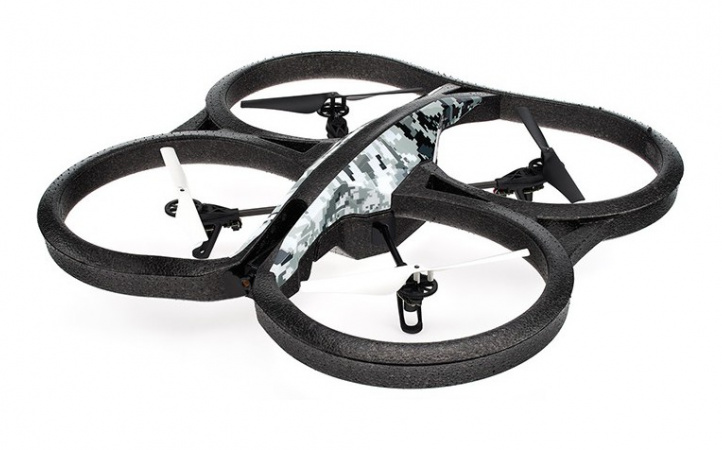

# QRDrone

This repo is composed of two parts:
* A Python script to calibrate the camera of a Parrot AR.Drone 2.0. The script requires the libraries OpenCV-Python and psdrone.

* A small C++ program to scan QR-Codes using the camera of the Parrot AR.Drone 2.0. This program can be built with CMake and makes use (among others) of the libraries OpenCV, ZBar and cvdrone 

After cloning the repo, run the following commend to get a shallow clone of the submodule containing the cvdrone library:

git submodule update  --init --recursive --depth 1

