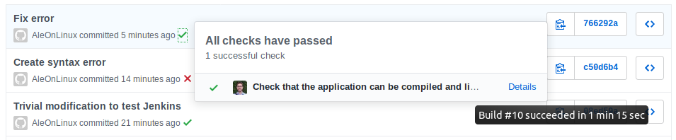
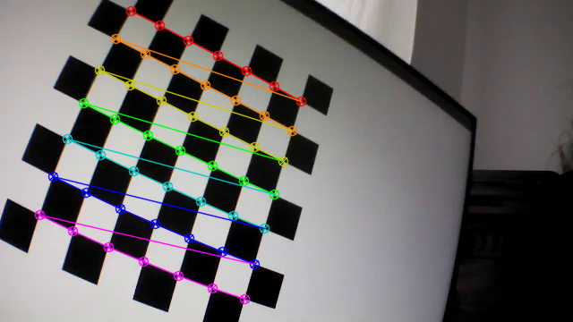
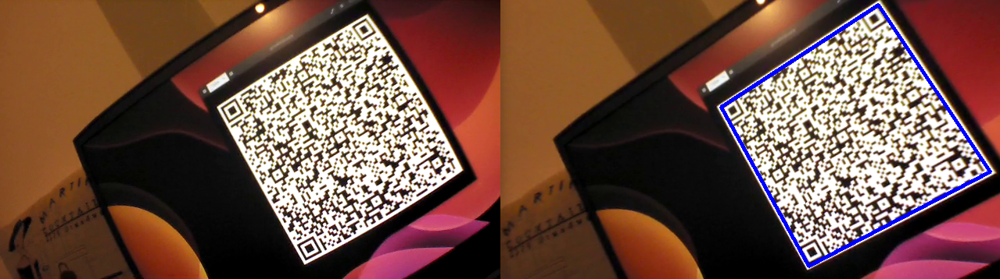

# QRDrone

This repo is composed of two parts:
* A Python script to calibrate the camera of a Parrot AR.Drone 2.0. The script requires the libraries OpenCV-Python and psdrone.
* A small C++ program to scan QR-Codes using the camera of the Parrot AR.Drone 2.0. This program can be built with CMake and uses (among others) the libraries OpenCV, ZBar and cvdrone 

A Jenkins server tests automatically that the application can be built and linked (see the [commits](https://github.com/alebruno/QRDrone/commits/master) page).

After cloning the repo, run the following command to get a shallow clone of the submodules containing the cvdrone and the psdrone libraries:

git submodule update  --init --recursive --depth 1

